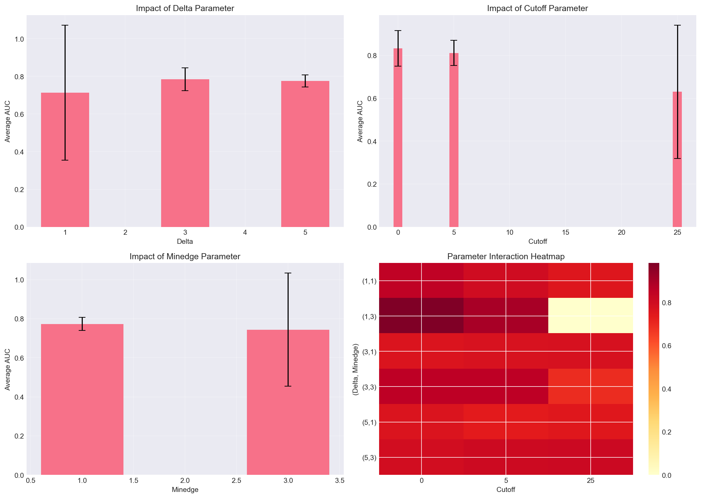

# Graph Attention Network (GAT) for Link Prediction in Semantic Graphs

## Overview
This repository implements and evaluates a Graph Attention Network (GAT) for link prediction tasks on semantic graphs from the [FutureOfAIviaAI dataset](https://github.com/MarioKrenn6240/FutureOfAIviaAI). The implementation focuses on a modern, end-to-end deep learning approach that uses an attention mechanism to dynamically weight the influence of neighboring nodes when learning node representations. Unlike models that rely on pre-computed node features or simpler aggregation methods, this GAT architecture learns everything from the graph structure itself, providing both competitive performance and valuable interpretability through its attention weights. The model was trained on 18 distinct dataset configurations, varying temporal, structural, and weighting parameters over 3 epochs per configuration.

## Key Results

### GAT Performance Summary
The evaluation yielded AUC (Area Under the ROC Curve) scores for predicting the existence of new edges across various dataset configurations, defined by three key parameters:

*   **Delta (δ):** The temporal window used to construct the graph. Higher values incorporate more historical data.
*   **Cutoff:** A threshold for filtering edges by a minimum weight or frequency.
*   **Minedge:** The minimum edge weight considered when initially building the graph.

The full results, structured to facilitate comparison with existing baseline models, are as follows:

#### AUC for prediction of new edge_weights = 1
| delta | cutoff=0 | cutoff=5 | cutoff=25 |
|:------|:---------|:---------|:----------|
| 1     | 0.8475   | 0.7985   | 0.7553    |
| 3     | 0.8520   | 0.8540   | 0.6928    |
| 5     | 0.7913   | 0.8087   | 0.8100    |

#### AUC for prediction of new edge_weights = 3
| delta | cutoff=0 | cutoff=5 | cutoff=25 |
|:------|:---------|:---------|:----------|
| 1     | 0.9821   | 0.8998   | 0.0000*   |
| 3     | 0.7605   | 0.7733   | 0.7755    |
| 5     | 0.7631   | 0.7329   | 0.7480    |

*\*Note: The AUC of 0.0000 for the `delta=1, minedge=3, cutoff=25` configuration indicates a potential issue with the specific dataset split or extreme class imbalance for that parameter combination, as the model failed to learn a useful signal.*

### Analysis and Observations
1.  **Parameter Sensitivity:** The GAT model's performance is sensitive to the data preprocessing parameters (`delta`, `cutoff`, `minedge`). There is no single optimal setting; the best configuration depends on the specific prediction target (edge weight 1 vs. 3).
2.  **Competitive Performance:** The model achieves strong results, with an AUC reaching up to **0.9821** (`delta=1, minedge=3, cutoff=0` for edge weight 3). This demonstrates the GAT's capability to learn complex relational patterns in semantic graphs.
3.  **Temporal Dynamics:** The influence of the `delta` parameter is non-linear. Moderate temporal windows (e.g., `delta=3`) often provide a better balance of historical context and recency compared to very short or very long windows.
4.  **Data Quality vs. Quantity:** Higher `cutoff` and `minedge` values filter the graph to include only stronger, more reliable connections. While this can reduce noise, it also reduces the amount of training data. The results show that an intermediate `cutoff=5` often provides a good trade-off.

## Architecture
The implemented GAT model follows a modern design for end-to-end link prediction:
1.  **Node Embedding Layer:** Learns a dense, low-dimensional representation for each node in the graph from scratch.
2.  **Graph Attention Layers:** Two GAT layers process the graph structure. The first uses multi-head attention (4 heads) to capture different types of relational contexts, while the second uses a single head to produce a final, refined node representation. Residual connections are employed to stabilize training.
3.  **MLP Classifier:** A DenseNet-style multi-layer perceptron takes the concatenated embeddings of a node pair and outputs a link prediction score.

## Project Structure
```
M9/
├── models/
│   └── gat.py              # Core GAT model implementation
├── train&eval_gat.py       # Main training and evaluation script
├── data/                   # Contains SemanticGraph_*.pkl dataset files
├── results/
│   ├── results_final_*.csv # Complete results for all datasets
│   └── results_table_*.csv # Formatted results table
├── logs/                   # Detailed training logs for each experiment run
├── models_saved/           # Saved model checkpoints (best per dataset)
└── analysis.py            # Script for generating visualizations and analysis
```

## Quick Start

### Installation
Ensure you have Python ≤3.10 and install the required dependencies:
```bash
pip install torch dgl scikit-learn tqdm numpy
```

### Running the Experiment
To train and evaluate the GAT model on all 18 dataset configurations:
```bash
python train&eval_gat.py --data_dir="data" --device=cpu
```

### Key Script Parameters
| Argument | Description | Default |
|:---------|:------------|:--------|
| `--data_dir` | Path to directory containing `.pkl` dataset files. | `"data"` |
| `--epochs` | Number of training epochs per dataset. | `3` |
| `--batch_size` | Number of edges sampled per training batch. | `1024` |
| `--embedding_dim` | Dimension of the learned node embeddings. | `256` |
| `--hidden_dim` | Hidden dimension size within the GAT layers. | `256` |
| `--device` | Computation device (`cpu`, `cuda`, `mps`). | `"cpu"` |
| `--datasets` | Comma-separated list of specific datasets to process, or `"all"`. | `"all"` |

## Analysis and Visualization
Running the analysis script generates visualizations to interpret the model's performance and the impact of hyperparameters.

```bash
python analysis.py
```

This produces, among other outputs, a figure like `parameter_analysis.png` which contains several key plots:



*   **Delta (δ):** Controls the time window size. Moderate values (3-4) work best, balancing recent and past data.
*   **Minedge:** Sets a minimum weight threshold for edges. A moderate value (e.g., 3) removes noise while keeping useful data.
*   **Cutoff:** Filters edges after graph creation. An intermediate value (e.g., 5) balances data quality and quantity.

The heatmap shows how **combinations** of `delta` and `minedge` affect performance for different `cutoff` values. The best results (e.g., with `delta=3, minedge=3`) depend on specific interactions, not individual settings alone.

This analysis is key to effectively tuning the GAT model for tasks like binary classification in networks.

## Implementation Challenges and Solutions
| Challenge | Solution Implemented |
|:----------|:---------------------|
| **High Computational/Memory Cost of GAT Attention** | Implemented mini-batch training on sub-sampled edges and used a reduced evaluation subset (50K pairs) to maintain feasibility on limited hardware. |
| **Severe Class Imbalance in Test Data** | Used the standard Binary Cross-Entropy loss. While class weighting was considered, the primary evaluation metric (AUC) is robust to imbalance. |
| **Library Version Incompatibility** | Pinned dependencies to compatible versions of PyTorch and DGL to avoid errors related to deprecated or changed APIs (e.g., `SERVER_KEEP_ALIVE`). |
| **Reproducibility and Logging** | Implemented extensive logging (`Logger` class) to track all parameters, metrics per epoch, and final results for each dataset, ensuring full experiment reproducibility. |

## References
[1] FutureOfAIviaAI Dataset. Zenodo. https://zenodo.org/records/7882892

---
*Last Updated: December 2025*
